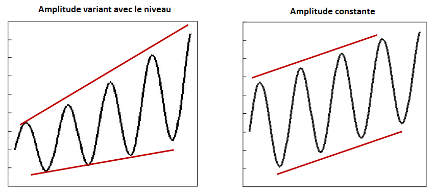

```{r, include = FALSE}
knitr::opts_chunk$set(
  collapse = TRUE,
  comment = "#>"
)
```

```{r setup, include = FALSE}
library(gstest)
```


Description des étapes d'un projet d'étalonnage typique avec G-Séries (librairie R gstest).

Autres ressources utiles liées au problème d'étalonnage de séries chronologiques discuté ici et résolu à l'aide des fonctions d'étalonnage de G-Séries (`benchmarking()` et `stock_benchmarking()`), par ordre croissant de complexité technique :

- Fortier et Quenneville (2007), dans ***Références*** pour la fonction `benchmarking()`, pour une vue d'ensemble de la méthodologie de l'étalonnage de séries chronologiques implémentée dans G-Séries avec des exemples détaillés (en anglais seulement). Ce document est disponible dans GCdocs pour les employés de Statistique Canada (recherchez « ICES2007_Fortier.pdf » dans GCDocs).

- Cours 0436, « Théorie et application de l’étalonnage », dans ***Références*** pour les fonctions `benchmarking()` et  `stock_benchmarking()`. Consultez la page web [Cours 0436](https://www.statcan.gc.ca/fr/formation/statistique/0436) (site web grand public de Statistique Canada) pour plus de détails.

- Dagum et Cholette (2006), dans ***Références*** pour la fonction `benchmarking()`, pour une discussion technique complète et une présentation des problèmes d'étalonnage de séries chronologiques et de leur solution (en anglais seulement).

<br>

***

<br>

### 1. Préparer les données d'entrée

La première étape consiste généralement à convertir les objets « ts » ou « mts » (librairie stats) dans le format approprié pour les fonctions d'étalonnage de G-Séries à l'aide des deux fonctions utilitaires suivantes ;

- `ts_to_tsDF()` pour les séries indicatrices

- `ts_to_bmkDF()` pour les étalons

Il est possible d'étalonner plusieurs séries en un seul appel aux fonctions d'étalonnage. Ceci peut être fait en spécifiant la liste appropriée des variables des *data frames* d'entrée avec les arguments `var` et `with`, ce qui peut être lourd à gérer et donner à votre code un aspect *encombré*. Une option plus pratique pour obtenir le même résultat serait d'utiliser l'argument `allCols`. Cependant, ces deux alternatives ont d'importantes limitations car elles requièrent toutes deux que toutes les séries indicatrices soient de la même longueur (même nombre de périodes) et aient le même ensemble (nombre) d'étalons. Les valeurs des étalons peuvent évidemment différer pour chaque série indicatrice, mais leur couverture doit être la même.

Une approche plus souple, qui ne souffre pas des limitations mentionnées ci-dessus, consiste à utiliser le mode _groupes-BY_ 
(argument `by`) des fonctions d'étalonnage après avoir converti les *data frames* d'entrée en versions _empilées_ (longues) à l'aide des fonctions utilitaires suivantes :

- `stack_tsDF()` pour les séries indicatrices

- `stack_bmkDF()` pour les étalons

Les versions empilées des *data frames* n'utilisent que deux variables pour spécifier les informations concernant les différentes séries indicatrices ou séries d'étalons : une variable pour les identifiants et une autre pour les valeurs. Un *data frame* empilé contient donc plus d'enregistrements (lignes) mais moins de variables (colonnes) qu'un *data frame* non empilé, les séries chronologiques étant _empilées_ les unes sur les autres au lieu d'être _étalées_ les unes à côté des autres. Le traitement _groupes-BY_ avec des *data frames* empilés est l'approche recommandée pour étalonner plusieurs séries en un seul appel à la fonction d'étalonnage, à moins que le nombre de séries à comparer soit extrêmement important et que le temps de traitement soit une question vraiment cruciale (le traitement de séries chronologiques multiples avec les arguments `var` ou `allCols` devrait être légèrement plus rapide que l'approche _groupes-BY_ avec l'argument `by`).

<br>

### 2. Effectuer l'étalonnage

Le nombre d'appels aux fonctions d'étalonnage dépend des valeurs des arguments `rho`, `lambda`, `biasOption` et `bias` (plus `low_freq_periodicity`, `n_low_freq_proj` et `proj_knots_rho_bd` pour la fonction `stock_benchmarking()`). Un appel est nécessaire pour chaque combinaison distincte des valeurs de ces arguments. En pratique, cependant, seul l'argument `lambda` nécessitera habituellement des valeurs distinctes pour traiter l'ensemble des séries : `lambda = 1` pour un étalonnage proportionnel et `lambda = 0` pour un étalonnage additif. Deux appels aux fonctions d'étalonnage sont donc souvent suffisants.

Lorsque plus d'un appel est nécessaire, les *data frames* d'entrée pour les séries indicatrices est les étalons doivent être divisés en *data frames* distincts : un pour chaque appel avec l'ensemble pertinent de séries indicatrices et d'étalons. Il est également possible d'ajouter une ou plusieurs colonnes aux versions empilées des *data frames* d'entrée afin d'identifier (et d'extraire) les séries indicatrices et les étalons de chaque appel.

**Note sur l'étalonnage proportionnel et additif**\
L'étalonnage proportionnel ($\lambda \ne 0$) est normalement utilisé lorsque l'objectif principal est la préservation des ratios (différences relatives) d'une période à l'autre et l'étalonnage additif ($\lambda = 0$) pour la préservation des différences. Il est généralement préférable de privilégier l'analyse des ratios d'une période à l'autre pour les séries chronologiques dont l'amplitude (ex., les composantes saisonnières et irrégulières) varie selon le niveau de la série. En revanche, si l'amplitude de la série reste relativement constante quel que soit le niveau de la série, il convient d'examiner les différences d'une période à l'autre.

<center> {width=80%} </center>
<p line-height: 0.5> </p>

L'erreur la plus courante serait probablement l'utilisation d'une approche d'étalonnage additif lorsque les changements dans l'amplitude de la série d'indicateurs sont importants et suivent le niveau (l'amplitude augmente/diminue avec le niveau). Le principal avantage de l'étalonnage additif est qu'il fonctionne (retourne une solution) dans tous les contextes, alors que l'étalonnage proportionnel échouera dans certains cas particuliers (ex., un étalon non nul avec des valeurs de série indicatrice nulles pour toutes les périodes couvertes par l'étalon). L'étalonnage proportionnel avec $\rho < 1$ (étalonnage basé sur la régression) fonctionne généralement bien dans la pratique (fournit des solutions _raisonnables_) avec des problèmes impliquant des valeurs de zéro pour les séries indicatrices et/ou les étalons. Certaines personnes peuvent en fait apprécier (trouver attrayant) le fait que les valeurs de zéro dans la série indicatrice initiale demeurent zéro dans les séries étalonnées de manière proportionnelle, ce qui n'est pas le cas pour les séries étalonnées de manière additive. En ce qui concerne l'étalonnage proportionnel avec $\rho = 1$ (étalonnage de Denton), la série indicatrice doit être strictement positive. Cependant, on peut essayer d'utiliser l'argument `constant` afin d'ajouter une constante temporaire (relativement petite) aux données d'entrée et ainsi résoudre les cas qui impliquent des valeurs de zéro dans la série indicatrice. En pratique, on notera que l'étalonnage proportionnel de Denton peut également être _approximé_ avec l'approche basée sur la régression en utilisant une valeur de $\rho$ inférieure à, mais très proche de, $1.0$ (par exemple, $\rho = 0.999$). Enfin, bien que l'étalonnage proportionnel ($\lambda \ne 0, \forall \rho$) ne soit pas possible par défaut en présence de valeurs négatives, ce comportement peut être modifié avec l'argument `negInput_option`. Dans tous les cas, il convient de surveiller de près les séries étalonnées de manière proportionnelle impliquant des valeurs négatives ou des valeurs de zéro (ou presque zéro), où les ratios peuvent être indéfinis, instables ou difficiles à interpréter. Les données étalonnées de manière proportionnelle qui en résultent doivent être soigneusement analysées et validées dans de tels cas pour s'assurer qu'elles correspondent à des solutions raisonnables et interprétables.  

<br>

### 3. Valider les résultats

Tout message d'avertissement ou d'erreur généré par les fonctions d'étalonnage doit être examiné afin de résoudre le(s) problème(s) correspondant(s). Une fois que l'on a obtenu des exécutions propres des fonctions d'étalonnage (sans messages d'avertissement ou d'erreur), il faut valider les données des séries étalonnées qui en résultent. La fonction utilitaire `plot_graphTable()` génère des graphiques utiles pour réaliser cette tâche.

Exemples d'éléments à rechercher dans les résultats d'étalonnage :

- **Ajustements d'étalonnage projetés inadéquats**. La solution de l'étalonnage pour les périodes non couvertes par un étalon en fin de série est déterminée par le paramètre $\rho$ (argument `rho`) et la correction pour le biais (spécifiée avec les arguments `biasOption` et `bias`). La correction du biais est généralement recommandée lorsque le niveau des étalons et des valeurs de la série indicatrice sont systématiquement différents (ex., les étalons sont toujours, ou presque toujours, plus grands que la série indicatrice ou vice versa). Le fait de ne pas corriger un biais (important) peut entraîner de mauvais résultats pour les périodes non couvertes par un étalon (ajustements d'étalonnage projetés inadéquats), ce qui peut ensuite conduire à d'importantes révisions lorsque de nouveaux étalons seront disponibles à l'avenir. La correction du biais devrait aider dans de tels cas. Une exception est l'étalonnage de Denton ($\rho = 1$) où la correction du biais n'a pas d'impact sur la solution de l'étalonnage. La modification de la valeur du paramètre $\rho$, qui détermine la vitesse à laquelle les ajustements projetés convergent vers le biais pour les périodes non couvertes par un étalon, peut également améliorer la situation. Plus la valeur de $\rho$ est petite, plus la convergence est rapide, avec une convergence immédiate lorsque $\rho = 0$ et pas de convergence du tout (l'ajustement de la dernière période couverte par un étalon est répété) lorsque $\rho = 1$ (étalonnage de Denton). Une recommandation générale qui fonctionne raisonnablement bien dans la plupart des cas est d'ajuster avec le biais moyen estimé (`biasOption = 3` et `bias = NA`) et d'utiliser $\rho = 0.9$ avec des indicateurs mensuels et $\rho = 0.9^3 = 0.729$ avec des indicateurs trimestriels. La spécification d'un biais défini par l'utilisateur (argument `bias`) peut être pertinente si les écarts entre les deux sources de données ont évolué dans le temps (ex., spécifier une valeur plus représentative du _biais récent_). Une autre solution consisterait à utiliser des prévisions _explicites_ pour les étalons en fin de série au lieu de s'appuyer sur les étalons projetés _implicites_ associés à l'ajustement du biais et au paramètre $\rho$. Par exemple, des informations auxiliaires disponibles pourraient être utilisées pour générer des étalons explicites et (si les prévisions sont bonnes) réduire les révisions une fois que les vraies valeurs des étalons seront connues. Les deux premiers graphiques d'étalonnage (_Original Scale Plot_ et _Adjustment Scale Plot_) de la fonction `plot_graphTable()` devraient aider à identifier les problèmes potentiels avec les projections.

- **Paramètre autorégressif $\rho$ (argument `rho`) inadéquat**. L'objectif de l'étalonnage est généralement de préserver les mouvements de période à période de la série indicatrice, ce qui correspond à des valeurs de $\rho$ relativement proches de 1 et à des ajustements d'étalonnage lisses. Ceci étant dit, certains cas particuliers peuvent justifier de faibles valeurs de $\rho$ correspondant à des ajustements _moins lisses_ et une préservation du mouvement plus faible. Le 2^e^ graphique d'étalonnage (_Adjustment Scale Plot_) de la fonction `plot_graphTable()` montre les ajustements d'étalonnage et peut donc être utilisé pour vérifier le « caractère lisse » des ajustements et modifier, si nécessaire, la valeur du paramètre $\rho$. Le degré de préservation du mouvement correspondant est illustré par les 3^e^ et 4^e^ graphiques d'étalonnage (_Growth Rates Plot_ et _Table_) de la fonction `plot_graphTable()`. Notez que les ajustements d'étalonnage peuvent également être tracés en utilisant la fonction utilitaire `plot_benchAdj()`.

- **Paramètre du modèle d'ajustement $\lambda$ (argument `lambda`) inadéquat**. L'étalonnage additif est mis en œuvre lorsque $\lambda = 0$ et l'étalonnage proportionnel dans le cas contraire (lorsque $\lambda \ne 0$). Le choix du modèle d'ajustement _idéal_ n'est pas nécessairement évident. Se référer à la _Note sur l'étalonnage proportionnel et additif_ ci-dessus pour en savoir plus. Essayer les deux approches d'étalonnage et comparer les graphiques d'étalonnage peut aider à choisir le modèle d'ajustement le plus  _adéquat_. Par exemple, l'approche qui génère une série d'étalonnage d'apparence plus naturelle dans le 1^er^ graphique (_Original Scale Plot_), des ajustements d'étalonnage plus lisses dans le 2^e^ graphique (_Adjustment Scale Plot_) et une meilleure préservation du mouvement dans les 3^e^ et 4^e^ graphiques (_Growth Rates Plot_ et _Table_) devrait être privilégiée. L'examen des graphiques d'étalonnage de la fonction `plot_graphTable()` devrait également permettre d'identifier les solutions problématiques qui pourraient nécessiter un changement de modèle d'ajustement. Par exemple, les cas problématiques d'étalonnage proportionnel avec des valeurs négatives (voir l'argument `negInput_option`) ou des valeurs nulles ou presque nulles pour les étalons ou les séries indicatrices risquent fort probablement de générer des séries étalonnées d'_apparence suspecte_ dans le 1^er^ graphique (_Original Scale Plot_), des ajustements extrêmes ou non lisses dans le 2^e^ graphique (_Adjustment Scale Plot_) ou une mauvaise préservation des mouvements dans les 3^e^ et 4^e^ graphiques (_Growth Rates Plot_  et _Table_). Un étalonnage additif peut être une meilleure alternative dans de tels cas.

Porter un regard attentif à tous les graphiques n'est pas nécessairement réalisable en pratique pour les grands projets d'étalonnage impliquant de nombreuses séries. Une analyse de classification (grossière) des données du _data frame_ de sortie **graphTable** des fonctions d'étalonnage (l'entrée de la fonction `plot_graphTable()`) peut aider à identifier les cas nécessitant une investigation plus poussée et un _regard plus attentif_ aux graphiques d'étalonnage.

**Note sur les séries de stocks**\
L'étalonnage de séries de stocks avec la fonction `benchmarking()` génère des ajustements non lisses (« bris » dans les ajustements) autour de chaque étalon, quelles que soient les valeurs de $\rho$ et de $\lambda$. Ceci est dû à la nature des étalons, c'est-à-dire des valeurs discrètes couvrant une seule période (points d'ancrage). La fonction `stock_benchmarking()`, spécifiquement destinée à l'étalonnage des séries de stocks, fournit généralement de meilleurs résultats (c.-à-d., une meilleure préservation des mouvements et des ajustements plus lisses). La fonction `plot_benchAdj()` est particulièrement utile pour comparer (superposer) les ajustements de séries de stocks générés par les fonctions `benchmarking()` et `stock_benchmarking()`. 

<br>

### 4. Traiter les données étalonnées

L'étape finale consiste généralement à convertir les données étalonnées (_data frame_ de sortie **series** des fonctions d'étalonnage) en objets « ts » (ou « mts ») avec la fonction utilitaire `tsDF_to_ts()`. Lorsqu'un traitement par _groupes-BY_ (argument `by`) est utilisé, il faut d'abord _désempiler_ les données des séries étalonnées en utilisant la fonction utilitaire `unstack_tsDF()` avant d'appeler la fonction `tsDF_to_ts()`.

**Étalons non contraignants (_nonbinding benchmarks_)**\
Bien que les problèmes d'étalonnage impliquant des étalons non contraignants (coefficients d'altérabilité supérieurs à 0) soient relativement rares en pratique, il est important de se rappeler que le _data frame_ de sortie **benchmarks** des fonctions d'étalonnage contient toujours les étalons originaux (non modifiés) fournis en entrée. Dans de tels cas, les étalons non contraignants modifiés seraient récupérés (calculés) à partir du _data frame_ de sortie **series**. Par exemple, les flux étalonnés résultant d'un appel à `benchmarking()` peuvent être agrégés en utilisant la fonction `stats::aggregate.ts()` après avoir d'abord converti le _data frame_ de sortie **series**  en un objet « ts » avec la fonction utilitaire `tsDF_to_ts()`.
