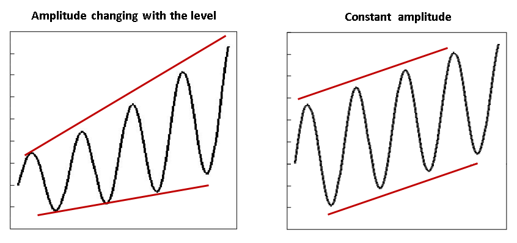

```{r, include = FALSE}
knitr::opts_chunk$set(
  collapse = TRUE,
  comment = "#>"
)
```

```{r setup, include = FALSE}
library(gstest)
```

<!-- Display the link to the French web page only when rendering an HTML document
     (e.g., not when rendering the PDF version)
     
     => the Pandoc "fenced_div" below (::: {.pkgdown-devel} <...> :::) is used to avoid 
        having the link generated in the pkgdown website vignette page
     => the link would only show in the "development" version of the pkgdown website
        (`development: mode: devel` in `_pkdown.yml` or `development: mode: auto` with a 4-level 
        version number in the DESCRIPTION file), which we do not use for gstest (we set 
        `development: mode: release` in `_pkdown.yml`, resulting in a single "release" website 
        regardless of the version number -->
::: {.pkgdown-devel}
```{asis, echo=knitr::is_html_output()}
(*version française : <https://ferlmic.github.io/gstest/fr/articles/benchmarking-cookbook.html>*)
```
:::


Description of the steps of a typical benchmarking project with G-Series (R package gstest).

Other useful resources related to the time series benchmarking problem discussed here and solved using the G-Series benchmarking functions (`benchmarking()` and `stock_benchmarking()`), in ascending order of technical complexity:

- Fortier and Quenneville (2007), in ***References*** for function `benchmarking()`, for an overview of the time series benchmarking methodology implemented in G-Series including detailed examples. This document is available in GCdocs for Statistics Canada employees (search for "ICES2007_Fortier.pdf" in GCDocs).

- Course 0436, “Theory and Application of Benchmarking”, in ***References*** for function `benchmarking()` and `stock_benchmarking()`. Visit the [Course 0436](https://www.statcan.gc.ca/en/training/statistical/0436) web page (Statistics Canada general public website) for more details.

- Dagum and Cholette (2006), in ***References*** for function `benchmarking()`, for a complete technical discussion and presentation of time series benchmarking problems and their solution.

<br>

***

<br>

### 1. Prepare the input data

The first step usually involves converting "ts" or "mts" objects (stats package) into the proper format for the G-Series benchmarking functions with the following two utility functions;

- `ts_to_tsDF()` for the indicator series

- `ts_to_bmkDF()` for the benchmarks

It is possible to benchmark multiple series in a single call to the benchmarking functions. This can be done by specifying the appropriate list of data frame variables with arguments `var` and `with`, which can be cumbersome and make your code look _cluttered_. A more convenient option to achieve the same result would be to use the `allCols` argument. However, these two alternatives have important limitations as they both require that all the indicator series are of the same length (same number of periods) and have the same set (number) of benchmarks. The values of the benchmarks can obviously differ for each indicator series, but their coverage must be the same.

A more flexible approach, which doesn't suffer from the aforementioned limitations, is to use the _BY-group_ mode (argument `by`) of the benchmarking functions after having converted the input data frames into _stacked_ (tall) versions with the following utility functions:

- `stack_tsDF()` for the indicator series

- `stack_bmkDF()` for the benchmarks

Stacked versions of the data frames use only two variables to specify information about the different indicator series or benchmarks: one variable for the identifiers and another for the values. A stacked data frame therefore contains more rows but fewer variables (columns) than a non-stacked data frame as the time series are _stacked_ on top of each other instead of being _layed out_ side by side. _BY-group_ processing with stacked data frames is the recommended approach to benchmark several series in a single benchmarking function call, unless the number of series to benchmark is extremely large and processing time is a really important issue (processing multiple time series with arguments `var` or `allCols` should be slightly faster than the BY-group approach with argument `by`).

<br>

### 2. Run benchmarking

The number of calls to the benchmarking functions depends on the values of arguments `rho`, `lambda`, `biasOption` and `bias` (plus `low_freq_periodicity`, `n_low_freq_proj` and `proj_knots_rho_bd` for function `stock_benchmarking()`). One call is necessary for each distinct combination of these argument values. In practice, however, only argument `lambda` will usually require distinct values to process the entire set of series: `lambda = 1` for proportional benchmarking and `lambda = 0` for additive benchmarking. Two calls to the benchmarking functions are therefore often enough.

When more than one call is required, the input indicator series and benchmarks data frames need to be split into distinct data frames: one for each call with the relevant set of indicator series and benchmarks. Alternatively, one can add one or several columns to the stacked versions of the input data frames in order to identify (and extract) the indicator series and benchmarks of each call.

**Note on proportional and additive benchmarking**\
Proportional benchmarking ($\lambda \ne 0$) is normally used when the main focus is the preservation of period-to-period ratios (relative differences) and additive benchmarking ($\lambda = 0$) for the preservation of period-to-period differences. Focusing on period-to-period ratios is usually preferable for time series for which the amplitude (e.g., seasonal and irregular components) changes with the level of the series. On the other hand, if the amplitude of the series stays relatively constant regardless of the level of the series, then looking at period-to-period differences is appropriate.

<center> {width=80%} </center>
<p line-height: 0.5> </p>

The most common _pitfall_ would likely be using an additive benchmarking approach when changes in the amplitude of the indicator series are important and follow the level (the amplitude increases/decreases with the level). The main advantage of additive benchmarking is that it _works_ (returns _a solution_) in all contexts while proportional benchmarking will fail in some particular cases (e.g., nonzero benchmark with zero indicator series values for all periods covered by the benchmark). Proportional benchmarking with $\rho < 1$ (regression-based benchmarking) generally works well in practice (provides _reasonable_ solutions) with problems involving values of zero for the indicator series and/or the benchmarks. Some people may actually appreciate (find appealing) the fact that values of zero in the initial indicator series always remain zero in proportionally benchmarked series, which is not the case for additively benchmarked series. As for proportional benchmarking with $\rho = 1$ (Denton benchmarking), the indicator series must be strictly positive. However, one could try using argument `constant` in order to add a (relatively small) temporary constant to the input data and solve cases that involve values of zero in the indicator series. In practice, note that proportional Denton benchmarking could also be _approximated_ with the regression-based approach by using a $\rho$ value that is smaller than, but very close to, $1.0$ (e.g., $\rho = 0.999$). Finally, although proportional benchmarking ($\lambda \ne 0, \forall \rho$) is not allowed by default in presence of negative values, this behaviour can be modified with argument `negInput_option`. In any case, one should closely monitor proportionally benchmarked series involving negative values or values of zero (or almost zero) where ratios may be undefined, unstable or difficult to interpret. The resulting proportionally benchmarked data should be carefully analyzed and validated in such cases to make sure they correspond to reasonable, interpretable solutions. 

<br>

### 3. Validate the results

Any warning and error message generated by the benchmarking functions should be investigated in order to fix the corresponding issue(s). Once clean executions of the benchmarking functions (free of warning and error messages) are obtained, one should validate the resulting benchmarked series data. Utility function `plot_graphTable()` generates useful graphics to perform such a task.

Examples of things to look for in the benchmarking results:

- **Inadequate projected benchmarking adjustments**. The benchmarking solution for periods not covered by a benchmark at the end of the series is driven by parameter $\rho$ (argument `rho`) and the specified bias adjustment (arguments `biasOption`and `bias`). Bias adjustment is generally recommended when the levels of the benchmarks and the indicator series are systematically different (e.g., benchmarks always, or almost always, larger than the indicator series or vice versa). Not correcting for an (important) bias  may result in poor results for the benchmarked series for periods not covered by a benchmark (poor projected benchmarking adjustments), which may then lead to large revisions as new benchmarks become available in the future. Correcting for the bias should help in such cases. An exception is _Denton benchmarking_ ($\rho = 1$) where bias adjustment has no impact on the benchmarking solution. Changing the value of parameter $\rho$, which dictates the speed at which the projected adjustments converge to the bias for periods not covered by a benchmark, may also improve the situation. The smaller the value of $\rho$ the faster the convergence, with immediate convergence when $\rho = 0$ and no convergence at all (the adjustment of the last period covered by a benchmark is repeated) when $\rho = 1$ (Denton benchmarking). A general recommendation that works reasonably well in most cases is to adjust with the estimated average bias (`biasOption = 3` and `bias = NA`) and use $\rho = 0.9$ for monthly indicators and $\rho = 0.9^3 = 0.729$ for quarterly indicators. Specifying a user-defined bias (argument `bias`) may be relevant if the discrepancies between the two sources of data have changed over time (e.g., specifying a value more representative of the _recent bias_). An alternative would be to use _explicit_ forecasts for the benchmarks at the end of the series instead of relying on the _implicit_ projected benchmarks associated to the bias adjustment and parameter $\rho$. For example, available auxiliary information could be used to generate explicit benchmarks and (if the projections are good) reduce revisions once the true benchmark values are known. The first two benchmarking graphs (_Original Scale Plot_ and _Adjustment Scale Plot_) of function `plot_graphTable()` should help identify potential issues with the projections.

- **Inadequate autoregressive parameter $\rho$ (argument `rho`)**. The goal of benchmarking usually is to preserve the period to period movements of the indicator series, to which correspond values of $\rho$ relatively close to 1 and smooth benchmarking adjustments. This being said, some particular cases may warrant small values of $\rho$ corresponding to _less smooth_ adjustments and reduced movement preservation. The 2^nd^ benchmarking graph (_Adjustment Scale Plot_) of function `plot_graphTable()` shows the benchmarking adjustments and can therefore be used to assess the _smoothness_ of the adjustments and modify, if necessary, the value of parameter $\rho$. The corresponding degree of movement preservation is illustrated by the 3^rd^ and 4^th^ benchmarking graphs (_Growth Rates Plot_ and _Table_) of function `plot_graphTable()`. Note that the benchmarking adjustments can also be plotted using utility function `plot_benchAdj()`.

- **Inadequate adjustment model parameter $\lambda$ (argument `lambda`)**. Additive benchmarking is implemented when $\lambda = 0$ and proportional benchmarking otherwise (when $\lambda \ne 0$). Choosing the _ideal_ adjustment model may not necessarily be obvious. Refer to the _Note on proportional and additive benchmarking_ above for some insights. Trying both an additive and a proportional benchmarking approach and comparing the benchmarking graphics may help choose the benchmarking adjustment model. For example, the approach that generates a more natural looking benchmarked series in the _Original Scale Plot_ (1^st^ graph), smoother benchmarking adjustments in the _Adjustment Scale Plot_ (2^nd^ graph) and better movement preservation in the _Growth Rates Plot_ and _Table_ (3^rd^ and 4^th^ graphs) should be favoured. Looking at the benchmarking graphics of function `plot_graphTable()` should also help identify problematic solutions that may require a change of adjustment model. For example, problematic cases of proportional benchmarking problems with negative values (see argument `negInput_option`) or values of zero or almost zero for the benchmarks or the indicator series would most likely generate _odd looking_ benchmarked series in the _Original Scale Plot_, extreme or non-smooth adjustments in the _Adjustment Scale Plot_ or poor movement preservation in the _Growth Rates Plot_  and _Table_. An additive benchmarking approach may be a better alternative in such cases.

Systematically looking at all the graphics may not necessarily be feasible in practice for large benchmarking projects involving many series. A (crude) classification analysis of the benchmarking functions' **graphTable** output data frame (the input of function `plot_graphTable()`) may help identify cases requiring further investigation and a _closer look_ at the benchmarking graphics.

**Note on stock series**\
Benchmarking stock series with the `benchmarking()` function generates non smooth adjustments (_kinks_) around each benchmark, regardless of the values of $\rho$ and $\lambda$. This is due to the nature of the benchmarks, i.e., discrete values covering a single period (anchor points). Function `stock_benchmarking()`, specifically aimed at benchmarking stock series, usually provides better results (i.e., improved movement preservation and smoother adjustments). Function `plot_benchAdj()` is especially useful to compare (overlay) the adjustments of stock series generated by functions `benchmarking()` and `stock_benchmarking()`. See ***Details*** for the `stock_benchmarking()` function for more information on the benchmarking of stock series. 

<br>

### 4. Process the benchmarked data

The final step usually involves converting the output benchmarked series data (benchmarking functions' **series** output data frame) into "ts" (or "mts") objects with utility function `tsDF_to_ts()`. When _BY-group_ processing (`by` argument) is used, one would first need to _unstack_ the benchmarked series data using utility function `unstack_tsDF()` before calling the `tsDF_to_ts()` function.

**Nonbinding benchmarks**\
Although benchmarking problems involving nonbinding benchmarks (benchmarking alterability coefficients greater than 0) are relatively rare in practice, it's important to remember that the benchmarking functions' output **benchmarks** data frame always contains the original (unmodified) benchmarks provided as input. In such cases, the modified nonbinding benchmarks would be recovered (calculated) from the output **series** data frame instead. For example, flows resulting from a `benchmarking()` call can be aggregated using function `stats::aggregate.ts()` after having converted the **series** output data frame into a "ts" object with utility function `tsDF_to_ts()`.
